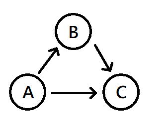

### 核心概念

首先我們來看這張簡易的圖。



如果我們想從 $$A$$ 走到 $$C$$，除了直接 $$A \rightarrow C$$ 以外，還有先 $$A \rightarrow B$$ 再 $$B \rightarrow C$$ 的道路。
兩種路徑都是從 $$A$$ 開始，結束於 $$C$$，在這方面這兩條路是等價的。

接下來，我們假設 $$A \rightarrow C$$ 這段路徑，實際上必須穿越一片森林。裡面危險重重，烏漆墨黑，可能還有詭異的`sus`生物居住。\
相較之下，$$A \rightarrow B$$、$$B \rightarrow C$$ 這兩條路，則是平整的柏油路，路上還開了不少店，嘴饞可以買杯珍奶來喝。

兩條路都是從 $$A$$ 走到 $$C$$，但相信在上述的情況中，大部分人會選擇走 $$A \rightarrow B \rightarrow C$$ 這條路。

如果將每條道路打上一個「危險係數 $$W$$」， $$A \rightarrow C$$ 這條路的 $$W$$ 就會較高，
$$A \rightarrow B$$、$$B \rightarrow C$$ 這兩條路的 $$W$$ 就會較低。\
我們為了降低危險係數、提高活到下一天的機率，選擇走 $$A \rightarrow B \rightarrow C$$，而非 $$A \rightarrow C$$。

有沒有發現? 如果將「危險係數」替換成「路徑長」，我們上述的操作就變成在找最短路徑的演算法了!

### 實作細節

從任一點 $$i$$ 走到 $$j$$，除了直接 $$i \rightarrow j$$ 以外，可能還可以經過一個介於兩者間的點 $$k$$: $$i \rightarrow k \rightarrow j$$。

對於這兩種情況，如果 $$i \rightarrow j$$、$$i \rightarrow k$$、$$k \rightarrow j$$ 三者都是路徑短的柏油路，那幹嘛還要繞遠路到 $$k$$，直接就走 $$i \rightarrow j$$ 就好了。\
但如果 $$i \rightarrow j$$ 需要穿越路徑超長的蜿蜒山路，那或許繞個道比較快。

具體來說，假設目前已知的 $$i \rightarrow j$$ 最短路徑為 $$dis[i][j]$$，此時得知有一個新的中介點 $$k$$，
則對於 $$i \rightarrow j$$ 的最短距離，有以下關係式:

$$dis[i][j] = \min(dis[i][j], dis[i][k] + dis[k][j])$$

除此之外，同一個點到同一個點之間的距離為 $$0$$(就已經在目的地了)。
如果兩點間沒有道路，那或許是因為隔了一個太平洋，那可不得了，危險係數突破天際了。此時距離可設為一個特別大的常數。

這個演算法被稱為 **Floyd-Warshall's Algorithm**，能在 $$O(n^3)$$ 的時間複雜度內，求出任意兩點之間的最短距離。\
由於實作起來非常方便，這個演算法某些時候也能用於某些測資小的，只求單點距離的題目。



```cpp
const int INF = 2e9;
const int MAXN = 105;
int dis[105][105], n, m; //假設有n個點，m條路

//全部先設為INF，自己到自己的距離=0
for (int i=0; i<n; i++)
  for (int j=0; j<n; j++)
    dis[i][j] = INF;

for (int i=0; i<n; i++) dis[i][i] = 0;

//以下為一個範例。看不懂沒關西，總之是在處理哪些點之間有路、路多長這兩個資訊。
//這裡假設路都是雙向的，也就是說如果P能走到Q，Q也能走到P。
//並再假設P, Q之間最多一條路，方便說明。
for (int i=0; i<m; ++i) {
  int P, Q, W;
  cin >> P >> Q >> W;
  dis[P][Q] = W;
  dis[Q][P] = W;
}

//Floyd-Warshall's Algorithm
for (int k=0; k<n; k++) //枚舉中介點k
  for (int i=0; i<n; i++) //枚舉起點
    for (int j=0; j<n; j++) //枚舉終點
      dis[i][j] = min(dis[i][j], dis[i][k] + dis[k][j])
      
//跑完之後，dis[i][j]就代表i→j的最短距離了!
```

